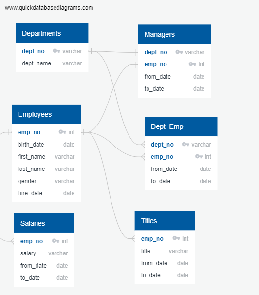

# Pewlett-Hackard-Analysis-SQL
## Overview of the analysis
___
In this analysis, I use SQL to query raw data that is given about a specific company's (Pewlett Hackard) employees, departments, titles and salaries and perform analysis to create tables that identify clean, key infomation about the companies employees such as a table of retired employees, current employees, departments and their managers, titles of employees who are retiring, etc. For this exercise I considered people who were born between 01/01/1952 and 12/31/1955 as employees who are going to retire.

By creating a table that displayed the count of employees retiring grouped by title, the large number of people retiring introduced a mentorship program where people who are about to retire would mentor the employees coming after them to take up their positions. This prompted me to create a list of current employees who would benefit/be eligible for the mentorship program.
## Results
* From the [retirement titles](data/retirement_titles.csv), it can be seen that a huge number of Senior Engineers and Senior Staff members are heading to retirement. Losing a bunch of Senior Engineers/Senior Staff members could be detrimental to the company's sucess since we will lose so many experienced members.
* It can also be seen that 2 managers will be leaving, it is a good thing we caught this early so that we can begin training new managers to take up that position.
* From the [mentorship eligibility](data/mentorship_eligibility.csv) it can be seen that a lot of these employees hold the same position; therefore, it is not as scary since there isn't much to teach.
* It can be seen from the mentorship eligibility that around 1000 employees are elgible for training while more than 50,000 employees are retiring, I think that expanding our pool of eligible candidates for the program would be a good idea to increase mentor:student ratio!
## Summary
* How many roles will need to be filled as the "silver tsunami" begins to make an impact?
Around 50,000 positions need to be filled from the retirement titles csv above.
* Are there enough qualified, retirement-ready employees in the departments to mentor the next generation of Pewlett Hackard employees?
The ratio is quite big, I think that increasing the pool of candidates that are elgible for the mentorship program would be a good idea as it would teach the more junior people as well!